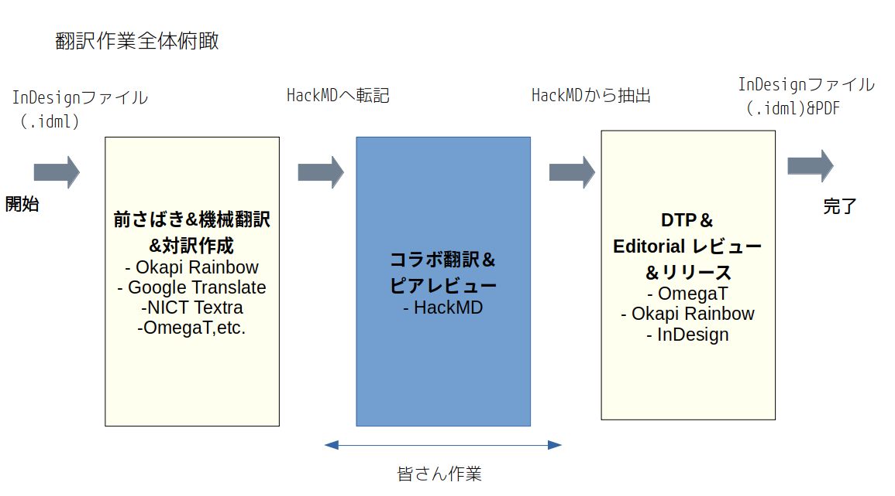

# CNCF Annual Report 2021 Translation 

This is Japanese Translation of "[CNCF Annual Report 2021](https://www.cncf.io/wp-content/uploads/2022/01/CNCF_Annual_Report_2021.pdf)".
And this is also one of collabolative translation efforts, and also "volunteer-base" translation. 

Note: The pdf file in "PDF_final" folder IS NOT released version (almost though). the pdf here was reviewed by LF Japan and released [here](https://www.cncf.io/reports/cncf-annual-report-2021/). 

## Translated and reviewed by:
@maabou512 (me)  @atoato88

## Supported by:
The Linux Foundation Japan

## Folders/Files

- **CNCF_Annual_Report_2021.pdf** 
Original PDF publcly released by CNCF

- **CNCF AR_01.indd** 
Orinal InDesign File ( not to be edited) 

- **CNCF AR_01_jp.indd** 
InDesign Japanese Translation file (to be edited), which was generated from IDML file via Rainbow conversion and OmegaT translation. 

- **PDF_Final ( Pre-release)** 
Final PDF file ( but released file is not this. see the note above) 

- **omegaT_rainbow** 
The folder in which omegaT translation memory, etc. and XLIFF files generated from Rainbow

- **Out_of_scope** 
Some sentences in the report are note text data,but image file(.ai/svg) . They cannot be translated directly, so we scoped out fo translation so far.

## About the LFJ Collaborative Translation Effort (CTE) 

***"How translation works can be more effective, efficient and ENJOYABLE in COLLABORATIVE manner? "*** 
This is a big challenge about translation, and is also a notion that **native authors don't care**. Our effortrs focus on this. And this output here is also a a case study of such such efforts, based on a process like below. 

